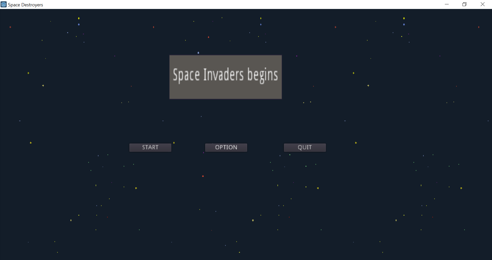
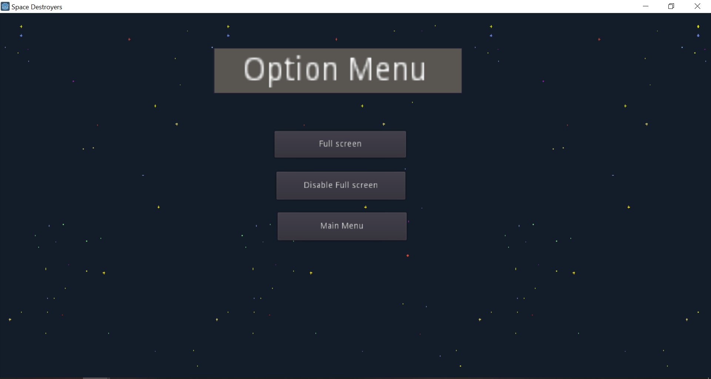
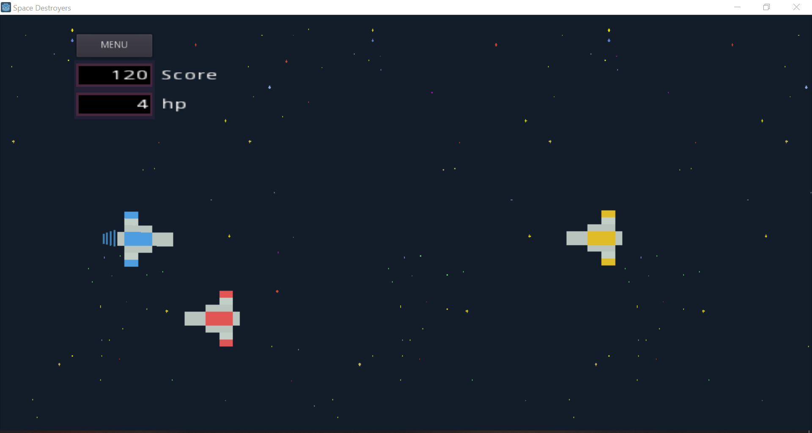
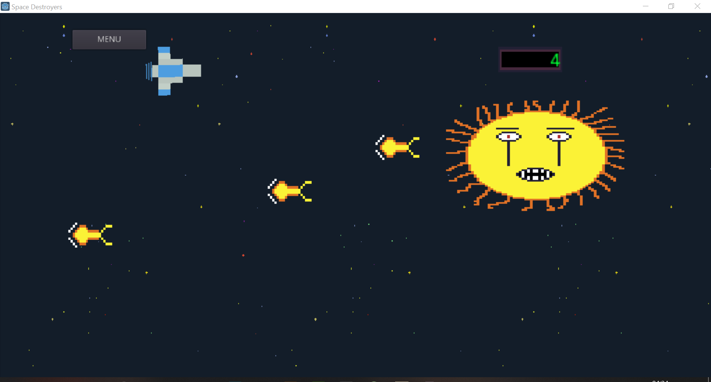

<h1>Space-Destroyers</h1>
<h2>Description</h2>
space side scroller made by begginer with Godot 3 the objective of this game is just kill enemies and gain 500 points to fight the boss
<h2>Screenshot</h2>

<h2>Language and tools</h2>
<b>Game engine : </b> 
Godot 3

<b>Sripting language : </b> 
GDscript

<b>Assets and animation</b> : 
im using free assets and i made the animation and boss on Aseprite

<h2>Contribution</h2>
<b>feels free to download this project and make changes and use the assets </b>
It Ain't Much, But it's Honest Work ^^
